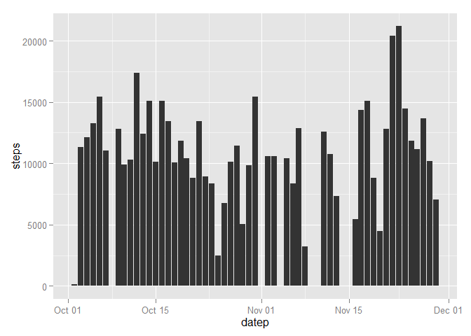
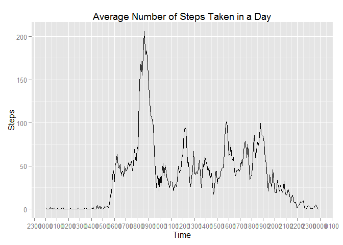

Reproducible Research: Assessment 1
=============================================
Created by Rux Wu 

### Initializing Settings


```r
library(knitr)
opts_chunk$set(echo = TRUE, results = 'hold', warning = FALSE)

library(ggplot2)
library(dplyr)
```

```
## 
## Attaching package: 'dplyr'
## 
## The following object is masked from 'package:stats':
## 
##     filter
## 
## The following objects are masked from 'package:base':
## 
##     intersect, setdiff, setequal, union
```

```r
library(scales)
```


### Loading and processing  data

```r
unzip("activity.zip")

act_csv <- read.csv(file = "activity.csv", na.string = "NA")

act_csv$datep <- as.Date(act_csv$date) # transform to Date
```


## What is mean total number of steps taken per day?
* Calculate the total number of steps taken per day


```r
act_step_date <- aggregate(steps ~ datep, act_csv, sum)
head(act_step_date)
```

```
##        datep steps
## 1 2012-10-02   126
## 2 2012-10-03 11352
## 3 2012-10-04 12116
## 4 2012-10-05 13294
## 5 2012-10-06 15420
## 6 2012-10-07 11015
```

* If you do not understand the difference between a histogram and a barplot, research the difference between them. Make a histogram of the total number of steps taken each day


```r
q <- ggplot(data = act_step_date, mapping = aes(x = datep, y= steps))
q1 <- q + layer(geom = "bar", stat = "identity")
q1
```

 

* Calculate and report the mean and median of the total number of steps taken per day


```r
act_mean <- mean(act_step_date$steps, na.rm = TRUE)
act_median <- median(act_step_date$steps, na.rm = TRUE)
```
The mean is **10766.189** and the median is **10765**.

## What is the average daily activity pattern?
* Make a time series plot (i.e. type = "l") of the 5-minute interval (x-axis) and the average number of steps taken, averaged across all days (y-axis)


```r
#clean data
act_csv$interval4 <- format(act_csv$interval, width = 4)
act_csv$interval4 <- gsub(pattern = " ", replacement = "0", act_csv$interval4)

daily_steps_mean <- aggregate(act_csv$steps, by = list(act_csv$interval4), FUN = mean, na.rm = TRUE)
names(daily_steps_mean) <- c("time", "avg.steps")
daily_steps_mean$timed <- strptime(x = daily_steps_mean$time, format = "%H%M")
```


```r
qplot(data = daily_steps_mean, x =timed, y = avg.steps, type = "l", geom = "line") + 
    scale_x_datetime(labels = date_format("%H%M"),  breaks = date_breaks("1 hour")) +
    xlab("Time") + ylab("Steps") + ggtitle("Average Number of Steps Taken in a Day")
```

 

* Which 5-minute interval, on average across all the days in the dataset, contains the maximum number of steps?

```r
daily_steps_mean[which(daily_steps_mean$avg.steps == max(daily_steps_mean$avg.steps)),1:2]
```

```
##     time avg.steps
## 104 0835  206.1698
```

### Imputing missing values

Note that there are a number of days/intervals where there are missing values (coded as NA). The presence of missing days may introduce bias into some calculations or summaries of the data.

- Calculate and report the total number of missing values in the dataset (i.e. the total number of rows with NAs)


```r
sum(is.na(act_csv$steps))
```

```
## [1] 2304
```

- Devise a strategy for filling in all of the missing values in the dataset. The strategy does not need to be sophisticated. For example, you could use the mean/median for that day, or the mean for that 5-minute interval, etc.

#### I am using 5-min mean

- Create a new dataset that is equal to the original dataset but with the missing data filled in.


```r
actr <- merge(act_csv, daily_steps_mean, by.x = "interval", by.y="time")
actr <- select(actr, c(1:4), c(avg.steps))
actr <- arrange(actr, date)
step.na.idx <- is.na(actr$steps)
actr$steps[step.na.idx] <- actr$avg.steps[step.na.idx]
```

- Make a histogram of the total number of steps taken each day

```r
actr_step_date <- aggregate(steps ~ datep, act_csv, sum)

ggplot(data = actr_step_date, mapping = aes(x = datep, y= steps)) + layer(geom = "bar", stat = "identity")
```

 


- Calculate and report the mean and median total number of steps taken per day. Do these values differ from the estimates from the first part of the assignment? What is the impact of imputing missing data on the estimates of the total daily number of steps?


```r
actr_mean <- mean(actr_step_date$steps, na.rm = TRUE)
actr_median <- median(actr_step_date$steps, na.rm = TRUE)
```
The mean is **10766.189** and the median is **10765**, which is same as those before imputing.
